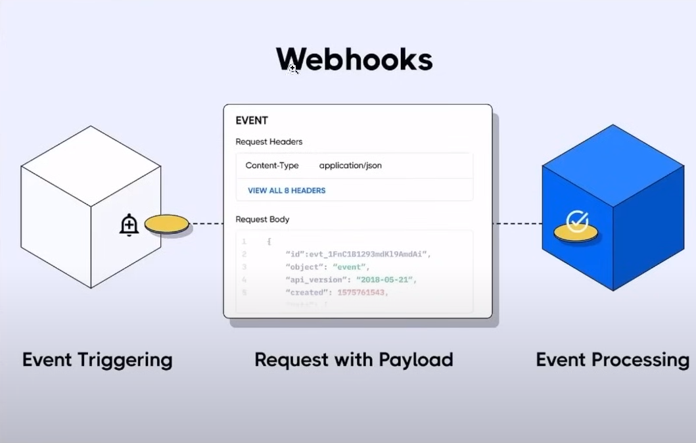
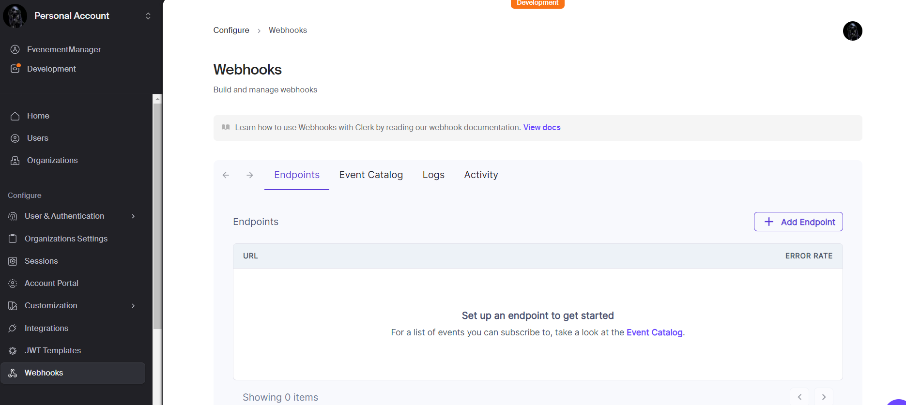
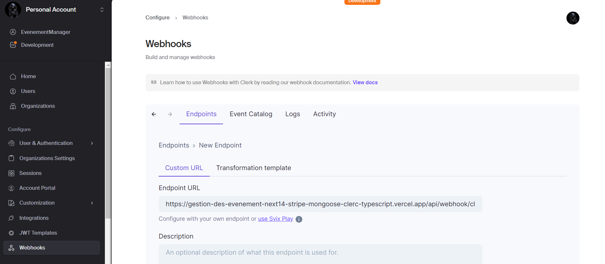
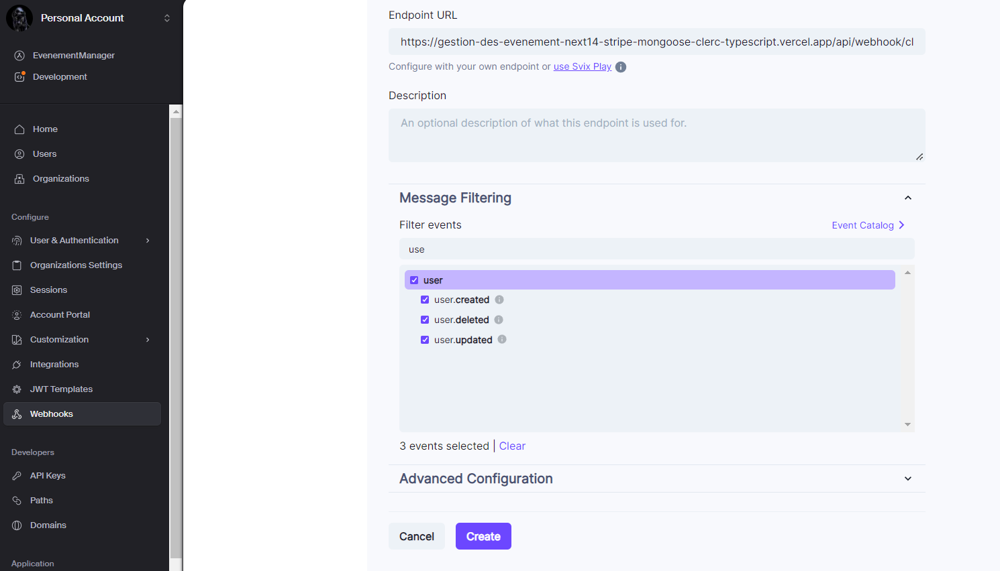
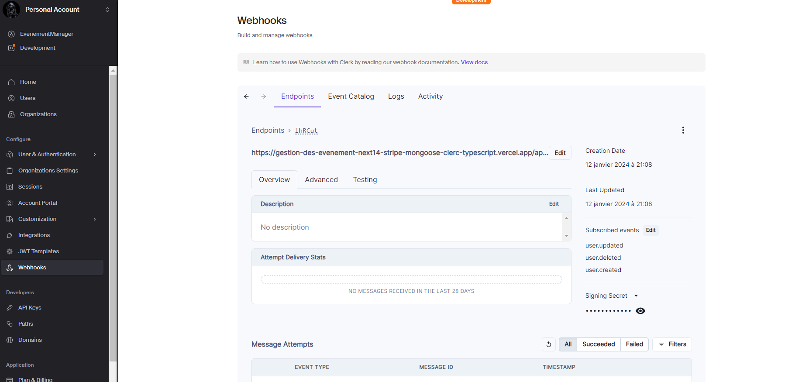
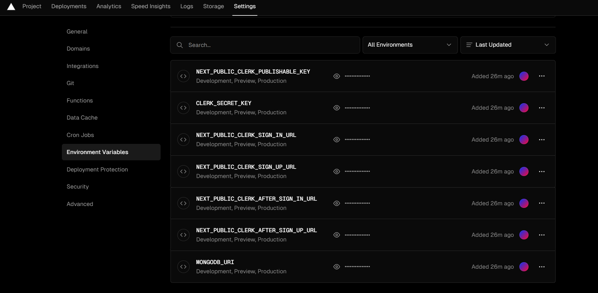
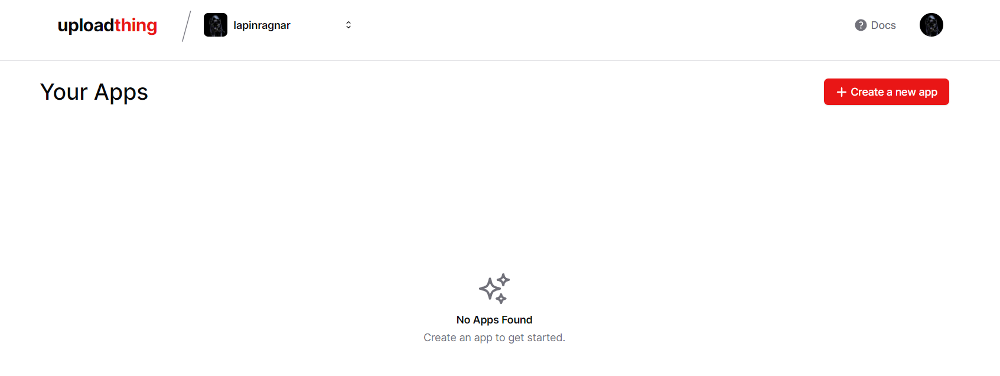
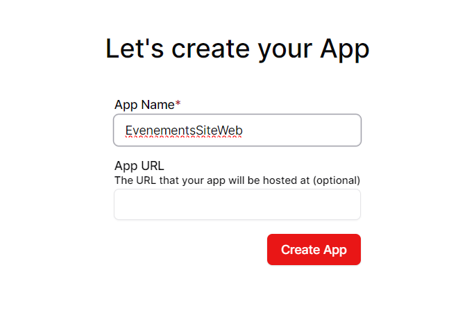
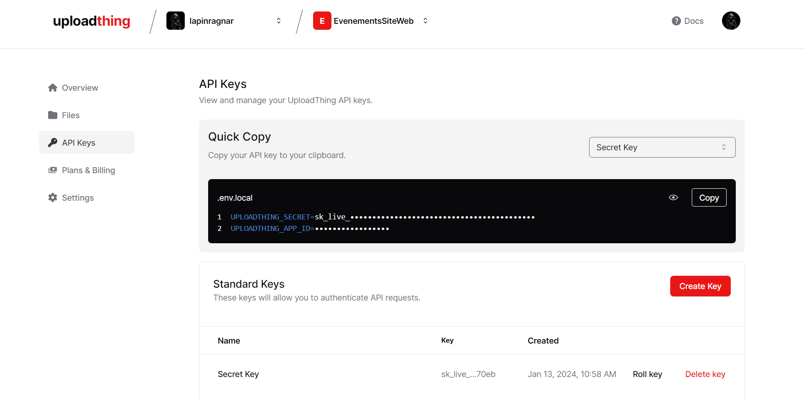

# I- primo


## les etapes de l'installation
## 1. next
```
pnpx create-next-app@latest 
```
puis suivre le prompt
## 2. shadcn ui
```
pnpm dlx shadcn-ui@latest init
npx shadcn-ui@latest init

```
puis suivre le prompt

## 3. configurer globals.css 
(voir le code )
## 4. configurer tailwind (tailwind.config.ts) et uploadthing pour l'upload file
- uploadthing : upload file for nextjs easily
https://uploadthing.com/
command line 
```
pnpm add uploadthing @uploadthing/react
npm install uploadthing @uploadthing/react

```

- tailwind.config.ts
(voir le code ) et les commandes sont:

> tailwind.config.ts
```
import { withUt } from "uploadthing/tw";
 
export default withUt({
  // Your existing Tailwind config
  content: ["./src/**/*.{ts,tsx,mdx}"],
  ...
});
```

## 5- routes && file structure


## 6- Header

#### a- cree un compte clerk sur leur site
- copier les variables d'environnement dans
> .env.local
```
NEXT_PUBLIC_CLERK_PUBLISHABLE_KEY=[votre clé]
CLERK_SECRET_KEY=[votre clé]
```
#### b- install clerk
```
pnpm add @clerk/nextjs
npm install @clerk/nextjs
```

#### c- wrap ton app avec le <ClerkProvider>
> app\(root)\layout.tsx
```
import { ClerkProvider } from '@clerk/nextjs'
import './globals.css'
 
export default function RootLayout({
  children,
}: {
  children: React.ReactNode
}) {
  return (
    <ClerkProvider>
      <html lang="en">
        <body>{children}</body>
      </html>
    </ClerkProvider>
  )
}
```

#### d- le middleware 

> app/middleware.ts
```
import { authMiddleware } from "@clerk/nextjs";
 
// This example protects all routes including api/trpc routes
// Please edit this to allow other routes to be public as needed.
// See https://clerk.com/docs/references/nextjs/auth-middleware for more information about configuring your Middleware
export default authMiddleware({});
 
export const config = {
  matcher: ["/((?!.+\\.[\\w]+$|_next).*)", "/", "/(api|trpc)(.*)"],
};


```

quand on se connecte sur localhost:3000, on est redirige vers /sign-in maintenant

## 6 - suite header
- ajouter le bouton <SignedOut> de clerk
- on cree app/(auth)/sign-in/[[...sign-in]]/page.tsx

> app/(auth)/sign-in/[[...sign-in]]/page.tsx
```
import { SignIn } from "@clerk/nextjs";

export default function Page() {
  return <SignIn />
}
```

- on cree app\(auth)\sign-up\[[...sign-up]]\page.tsx

> app/(auth)/sign-up/[[...sign-up]]/page.tsx
```
import { SignUp } from "@clerk/nextjs";

export default function Page() {
  return <SignUp />
}

```

- on ajoute : 

```
NEXT_PUBLIC_CLERK_SIGN_IN_URL=/sign-in
NEXT_PUBLIC_CLERK_SIGN_UP_URL=/sign-up
NEXT_PUBLIC_CLERK_AFTER_SIGN_IN_URL=/
NEXT_PUBLIC_CLERK_AFTER_SIGN_UP_URL=/

```

- on ajoute un layout 👍 dans (auth)
> app/(auth)/layout.tsx
```
const Layout = ({ children }: { children: React.ReactNode }) => {
  return (
    <div className="flex-center min-h-screen flex-col w-full bg-stone-800 bg-dotted-pattern bg-cover bg-fixed bg-center">
      {children}
    </div>
  )
}

export default Layout
```

- mettre username dans le formulaire le sign-in et le sign-up
  
  


- dans le header, ajouter le  <SignedIn> de clerk

> app/components/shared/Header.tsx
```
import { SignedIn, SignedOut, UserButton } from "@clerk/nextjs"
...
..
<SignedIn>
  <UserButton afterSignOutUrl="/" />
</SignedIn>


```

=> Après ça, on peut se connecter sur localhost:3000/sign-in
=> et tout fonctionne, Bravooooo!


# II- la suite

## 1- la navbar du mobile et du header
- creer un <NavItems /> en dessous du <UserButton afterSignOutUrl="/" />
  > app/components\shared\Header.tsx
 
  ```

  import NavItems from "@/components/shared/NavItems"

  const Header = () => {
    ....
      <SignedIn>
        <UserButton afterSignOutUrl="/" />
        <NavItems />
      </SignedIn>
    .....
  }

  export default Header
  ```

- on cree le : /components/shared/NavItems.tsx"
- regarde le code pour la suite
- install sheet de shadcn pour la bar de navigation à droite
```
npx shadcn-ui@latest add sheet
npx shadcn-ui@latest add separator


```

- regarde le code pour le reste

## 2- le footer

(voir le code)

## 3- le home page - le hero
(voir le code)


# III- le backend && database (mongoDB) à synchroniser avec la base de données de clerk (c'est du boulot - c chaud!)

## 1. mongoose - ORM pour se connecter au database
https://mongoosejs.com/

- command :
```
npm i mongoose mongodb
```

- créer le fichier : app/lib/mongoDb/database/index.ts
- cette technique est utilisé dans tous les applications Node.js => technique de cache

> app/lib/mongoDb/database/index.ts
```
import mongoose from 'mongoose';

const MONGODB_URI = process.env.MONGODB_URI;

let cached = (global as any).mongoose || { conn: null, promise: null };

export const connectToDatabase = async () => {
  if (cached.conn) return cached.conn;

  if(!MONGODB_URI) throw new Error('MONGODB_URI is missing');

  cached.promise = cached.promise || mongoose.connect(MONGODB_URI, {
    dbName: 'evently',
    bufferCommands: false,
  })

  cached.conn = await cached.promise;

  return cached.conn;
}

```

- se connecter au mongodb atlas et creer un compte
- on creer un nouveau projet 👍
  
  
- on va dans database, et on cree un database:
  
- on choisit FREE :
  

- creer un username et password, copie le dans le .env
- et puis suivre la suite et voila! braaaaavooo!

- le nom de notre database est : EvenementsSiteWeb

- ensuite va dans Network Access, puis Add Address IP, puis allow access from anywhere


- puis dans overview, puis connect : 


- puis, dans le driver, puis copier l'url :mongodb+srv://lapinragnar:<password>@cluster0.59ojkj5.mongodb.net/?retryWrites=true&w=majority dans le .env


- et coler dans .env.local et mettre l'username et password : 

```
MONGODB_URI=mongodb+srv://lapinragnar:<password>@cluster0.59ojkj5.mongodb.net/?retryWrites=true&w=majority
```

## 2. création des models

- on crée le fichier pour User : app/lib/mongoDb/models/user.model.ts
- et le code suivant 🥈:
> app/lib/mongoDb/models/user.model.ts
```
import { Schema, model, models } from "mongoose";

const UserSchema = new Schema({
  clerkId: { type: String, required: true, unique: true },
  email: { type: String, required: true, unique: true },
  username: { type: String, required: true, unique: true },
  firstName: { type: String, required: true },
  lastName: {type: String, required: true },
  photo: { type: String, required: true },
})

const User = models.User || model('User', UserSchema);

export default User;

```

- on fait la même chose pour le model event, order, category :

> app/lib/mongoDb/models/event.model.ts

```
import { Document, Schema, model, models } from "mongoose";

export interface IEvent extends Document {
  _id: string;
  title: string;
  description?: string;
  location?: string;
  createdAt: Date;
  imageUrl: string;
  startDateTime: Date;
  endDateTime: Date;
  price: string;
  isFree: boolean;
  url?: string;
  category: { _id: string, name: string }
  organizer: { _id: string, firstName: string, lastName: string }
}

const EventSchema = new Schema({
  title: { type: String, required: true },
  description: { type: String },
  location: { type: String },
  createdAt: { type: Date, default: Date.now },
  imageUrl: { type: String, required: true },
  startDateTime: { type: Date, default: Date.now },
  endDateTime: { type: Date, default: Date.now },
  price: { type: String },
  isFree: { type: Boolean, default: false },
  url: { type: String },
  category: { type: Schema.Types.ObjectId, ref: 'Category' },
  organizer: { type: Schema.Types.ObjectId, ref: 'User' },
})

const Event = models.Event || model('Event', EventSchema);

export default Event;

```


> app/lib/mongoDb/models/order.model.ts

```
import { Schema, model, models, Document } from 'mongoose'

export interface IOrder extends Document {
  createdAt: Date
  stripeId: string
  totalAmount: string
  event: {
    _id: string
    title: string
  }
  buyer: {
    _id: string
    firstName: string
    lastName: string
  }
}

export type IOrderItem = {
  _id: string
  totalAmount: string
  createdAt: Date
  eventTitle: string
  eventId: string
  buyer: string
}

const OrderSchema = new Schema({
  createdAt: {
    type: Date,
    default: Date.now,
  },
  stripeId: {
    type: String,
    required: true,
    unique: true,
  },
  totalAmount: {
    type: String,
  },
  event: {
    type: Schema.Types.ObjectId,
    ref: 'Event',
  },
  buyer: {
    type: Schema.Types.ObjectId,
    ref: 'User',
  },
})

const Order = models.Order || model('Order', OrderSchema)

export default Order

```

> app/lib/mongoDb/models/category.model.ts

```

import { Document, Schema, model, models } from "mongoose";

export interface ICategory extends Document {
  _id: string;
  name: string;
}

const CategorySchema = new Schema({
  name: { type: String, required: true, unique: true },
})

const Category = models.Category || model('Category', CategorySchema);

export default Category;


```


## 3. creation des fonctions qui va nous permettre de se connecter au database et d'utiliser les models

- le webhook (clerk) : quand clerc cree un user, on se synchronise avec le database
- la doc : https://clerk.com/docs/users/sync-data#sync-clerk-data-to-your-backend-with-webhooks




- activer le webhook sur clerk: on fait, add Endpoint
  



> ***les etapes de l'installation***


### a- Install the svix package
```
npm install svix
```

### b- Create the endpoint in your application

on cree le fichier

> app/api/webhooks/route.ts
```


```

on cree l'action : createUser dans 
> lib\actions\user.action.ts


```

import { Webhook } from 'svix'
import { headers } from 'next/headers'
import { WebhookEvent } from '@clerk/nextjs/server'
import { createUser, deleteUser, updateUser } from '@/lib/actions/user.action'
import { clerkClient } from '@clerk/nextjs'
import { NextResponse } from 'next/server'
 
export async function POST(req: Request) {
 
  // You can find this in the Clerk Dashboard -> Webhooks -> choose the webhook
  const WEBHOOK_SECRET = process.env.WEBHOOK_SECRET
 
  if (!WEBHOOK_SECRET) {
    throw new Error('Please add WEBHOOK_SECRET from Clerk Dashboard to .env or .env.local')
  }
 
  // Get the headers
  const headerPayload = headers();
  const svix_id = headerPayload.get("svix-id");
  const svix_timestamp = headerPayload.get("svix-timestamp");
  const svix_signature = headerPayload.get("svix-signature");
 
  // If there are no headers, error out
  if (!svix_id || !svix_timestamp || !svix_signature) {
    return new Response('Error occured -- no svix headers', {
      status: 400
    })
  }
 
  // Get the body
  const payload = await req.json()
  const body = JSON.stringify(payload);
 
  // Create a new Svix instance with your secret.
  const wh = new Webhook(WEBHOOK_SECRET);
 
  let evt: WebhookEvent
 
  // Verify the payload with the headers
  try {
    evt = wh.verify(body, {
      "svix-id": svix_id,
      "svix-timestamp": svix_timestamp,
      "svix-signature": svix_signature,
    }) as WebhookEvent
  } catch (err) {
    console.error('Error verifying webhook:', err);
    return new Response('Error occured', {
      status: 400
    })
  }
 
  // Get the ID and type
  const { id } = evt.data;
  const eventType = evt.type;

  if (eventType === 'user.created') {

    const { id, email_addresses, image_url, first_name, last_name, username } = evt.data;


    const user = {
      clerkId: id,
      email: email_addresses[0].email_address,
      username: username!,
      firstName: first_name,
      lastName: last_name,
      photo: image_url,
    }


    const newUser = await createUser(user);

    if(newUser) {
      await clerkClient.users.updateUserMetadata(id, {
        publicMetadata: {
          userId: newUser._id
        }
      })
    }

    return NextResponse.json({ message: 'OK', user: newUser })
  
  }


  if (eventType === 'user.updated') {
    const {id, image_url, first_name, last_name, username } = evt.data

    const user = {
      firstName: first_name,
      lastName: last_name,
      username: username!,
      photo: image_url,
    }

    const updatedUser = await updateUser(id, user)

    return NextResponse.json({ message: 'OK', user: updatedUser })
  }

  if (eventType === 'user.deleted') {
    const { id } = evt.data

    const deletedUser = await deleteUser(id!)

    return NextResponse.json({ message: 'OK', user: deletedUser })
  }


 
  console.log(`Webhook with and ID of ${id} and type of ${eventType}`)
  console.log('Webhook body:', body)
 
  return new Response('', { status: 200 })
}
 


```


on cree le type dans 

> app/types/index.ts

```
// ====== USER PARAMS
export type CreateUserParams = {
  clerkId: string
  firstName: string
  lastName: string
  username: string
  email: string
  photo: string
}

export type UpdateUserParams = {
  firstName: string
  lastName: string
  username: string
  photo: string
}

// ====== EVENT PARAMS
export type CreateEventParams = {
  userId: string
  event: {
    title: string
    description: string
    location: string
    imageUrl: string
    startDateTime: Date
    endDateTime: Date
    categoryId: string
    price: string
    isFree: boolean
    url: string
  }
  path: string
}

export type UpdateEventParams = {
  userId: string
  event: {
    _id: string
    title: string
    imageUrl: string
    description: string
    location: string
    startDateTime: Date
    endDateTime: Date
    categoryId: string
    price: string
    isFree: boolean
    url: string
  }
  path: string
}

export type DeleteEventParams = {
  eventId: string
  path: string
}

export type GetAllEventsParams = {
  query: string
  category: string
  limit: number
  page: number
}

export type GetEventsByUserParams = {
  userId: string
  limit?: number
  page: number
}

export type GetRelatedEventsByCategoryParams = {
  categoryId: string
  eventId: string
  limit?: number
  page: number | string
}

export type Event = {
  _id: string
  title: string
  description: string
  price: string
  isFree: boolean
  imageUrl: string
  location: string
  startDateTime: Date
  endDateTime: Date
  url: string
  organizer: {
    _id: string
    firstName: string
    lastName: string
  }
  category: {
    _id: string
    name: string
  }
}

// ====== CATEGORY PARAMS
export type CreateCategoryParams = {
  categoryName: string
}

// ====== ORDER PARAMS
export type CheckoutOrderParams = {
  eventTitle: string
  eventId: string
  price: string
  isFree: boolean
  buyerId: string
}

export type CreateOrderParams = {
  stripeId: string
  eventId: string
  buyerId: string
  totalAmount: string
  createdAt: Date
}

export type GetOrdersByEventParams = {
  eventId: string
  searchString: string
}

export type GetOrdersByUserParams = {
  userId: string | null
  limit?: number
  page: string | number | null
}

// ====== URL QUERY PARAMS
export type UrlQueryParams = {
  params: string
  key: string
  value: string | null
}

export type RemoveUrlQueryParams = {
  params: string
  keysToRemove: string[]
}

export type SearchParamProps = {
  params: { id: string }
  searchParams: { [key: string]: string | string[] | undefined }
}

```


on cree une fonction pour gérer nos erreurs dans 👍

> app/lib/utils.ts :

il faut installer query-string :

 ```
 npm i query-string
 ```

puis, copier le code suivant dans app/lib/utils.ts

```
import { type ClassValue, clsx } from 'clsx'

import { twMerge } from 'tailwind-merge'
import qs from 'query-string'

import { UrlQueryParams, RemoveUrlQueryParams } from '@/types'

export function cn(...inputs: ClassValue[]) {
  return twMerge(clsx(inputs))
}

export const formatDateTime = (dateString: Date) => {
  const dateTimeOptions: Intl.DateTimeFormatOptions = {
    weekday: 'short', // abbreviated weekday name (e.g., 'Mon')
    month: 'short', // abbreviated month name (e.g., 'Oct')
    day: 'numeric', // numeric day of the month (e.g., '25')
    hour: 'numeric', // numeric hour (e.g., '8')
    minute: 'numeric', // numeric minute (e.g., '30')
    hour12: true, // use 12-hour clock (true) or 24-hour clock (false)
  }

  const dateOptions: Intl.DateTimeFormatOptions = {
    weekday: 'short', // abbreviated weekday name (e.g., 'Mon')
    month: 'short', // abbreviated month name (e.g., 'Oct')
    year: 'numeric', // numeric year (e.g., '2023')
    day: 'numeric', // numeric day of the month (e.g., '25')
  }

  const timeOptions: Intl.DateTimeFormatOptions = {
    hour: 'numeric', // numeric hour (e.g., '8')
    minute: 'numeric', // numeric minute (e.g., '30')
    hour12: true, // use 12-hour clock (true) or 24-hour clock (false)
  }

  const formattedDateTime: string = new Date(dateString).toLocaleString('en-US', dateTimeOptions)

  const formattedDate: string = new Date(dateString).toLocaleString('en-US', dateOptions)

  const formattedTime: string = new Date(dateString).toLocaleString('en-US', timeOptions)

  return {
    dateTime: formattedDateTime,
    dateOnly: formattedDate,
    timeOnly: formattedTime,
  }
}

export const convertFileToUrl = (file: File) => URL.createObjectURL(file)

export const formatPrice = (price: string) => {
  const amount = parseFloat(price)
  const formattedPrice = new Intl.NumberFormat('en-US', {
    style: 'currency',
    currency: 'USD',
  }).format(amount)

  return formattedPrice
}

export function formUrlQuery({ params, key, value }: UrlQueryParams) {
  const currentUrl = qs.parse(params)

  currentUrl[key] = value

  return qs.stringifyUrl(
    {
      url: window.location.pathname,
      query: currentUrl,
    },
    { skipNull: true }
  )
}

export function removeKeysFromQuery({ params, keysToRemove }: RemoveUrlQueryParams) {
  const currentUrl = qs.parse(params)

  keysToRemove.forEach(key => {
    delete currentUrl[key]
  })

  return qs.stringifyUrl(
    {
      url: window.location.pathname,
      query: currentUrl,
    },
    { skipNull: true }
  )
}

export const handleError = (error: unknown) => {
  console.error(error)
  throw new Error(typeof error === 'string' ? error : JSON.stringify(error))
}


```


### c- A faire après le deploiement sinon ca ne marche pas

##### - ajouter un endpoint - Enable webhooks : https://gestion-des-evenement-next14-stripe-mongoose-clerc-typescript.vercel.app/api/webhook/clerk




- ensuite cocher user comme ceci:





- puis cliquer sur créer

- puis copier le signing secret:



- et le mettre dans le .env

> .env
```
WEBHOOK_SECRET="copier le code ici"
```

NB: Il faut aussi mettre cette clé dans vercel variable d'environnement

ici : 



*** <font color='red'> TRES IMPORTANT : IL FAUT REDEPLOYER l'application sur vercel pour mettre à jour les variables d'environnement </font>***


- on supprime l'user qu'on a crée dans clerk

- maintenant on test sur notre localhost:3000 de créer un nouvel user et on verifie si l'user est ajouté aussi dans la base de donnée mongodb

- Et voila ! Bravo !


# IV- deploiement sur vercel

- ojouter nouveau projet,
- importer le projet du github
- copier le .env


# V- la page event - creation, modification, suppression d'un event 

## 1- Create Event - les etapes de création de formulaire
on crée la page : app/(root)/events/create/page.tsx

avec le code suivant : 
> app/(root)/events/create/page.tsx
```

const CreateEvent = () => {
  return (
    <>
    
      <section className="bg-primary-50 bg-dotted-pattern bg-cover bg-center py-5 md:py-10">
        <h3 className="wrapper h3-bold text-center sm:text-left">Create Event</h3>
      </section>

      <div className="wrapper my-8">
        <EventForm />
      </div>
    
    </>
  )
}

```

on cree le composant <EventForm /> 👍, ** <font color="red"> cette forme va etre utiliser pour la création et la modification d'un event </font> **

> app/(root)/events/create/components/EventForm.tsx
```
'use client'

const EventForm = () => {
  return (
    <div>EventForm</div>
  )
}

export default EventForm

```

maintenant on peut cliquer le lien event dans notre navbar "event" et ca marche


### comment on recuper la session avec clerk 👍

> app/(root)/events/create/page.tsx
``` {.typescript .numberLines .lineAnchors highlight=[2,6-8]} 

import EventForm from "@/components/shared/EventForm"
import { auth } from "@clerk/nextjs"

const CreateEvent = () => {

  const { sessionClaims } = auth()
  const userId = sessionClaims?.userId as string
  console.log("sessionClaims", sessionClaims)
  
  return (
    <>
      <section className="bg-primary-50 bg-dotted-pattern bg-cover bg-center py-5 md:py-10">
        <h3 className="wrapper h3-bold text-center sm:text-left">Create Event</h3>
      </section>

      <div className="wrapper my-8">
        <EventForm />
      </div>
    </>
  )
}

export default CreateEvent

```

une autre façon de recuperer le userId :

```
import { auth } from "@clerk/nextjs"
..
..
....

const { userId } : { userId: string | null } = auth()
console.log("userId", userId);


```

on passe 2 props : userId et type dans EventForm : 

```
<EventForm userId={userId} type="Update" />
```


et on modifie, EventForm comme ceci :


> app/(root)/events/create/components/EventForm.tsx
```{.typescript .numberLines .lineAnchors highlight=[3-6,8,10]} 
'use client'

type EventFormProps = {
  userId: string | null
  type: "Create" | "Update"
}

const EventForm = ({ userId, type }: EventFormProps) => {
  return (
    <div>EventForm  {type} </div>
  )
}

export default EventForm

```

ensuite on fait la même chose pour l'update :
> app\(root)\events\[id]\update\page.tsx
```
import EventForm from "@/components/shared/EventForm"
import { auth } from "@clerk/nextjs"

const UpdateEvent = () => {

/*   const { sessionClaims } = auth()
  const userId = sessionClaims?.userId as string
  console.log("sessionClaims et userId", sessionClaims, userId) */
  
  const { userId } : { userId: string | null } = auth()
  console.log("userId", userId);
  

  return (
    <>
    
      <section className="bg-primary-50 bg-dotted-pattern bg-cover bg-center py-5 md:py-10">
        <h3 className="wrapper h3-bold text-center sm:text-left">Update Event</h3>
      </section>

      <div className="wrapper my-8">
        <EventForm userId={userId} type="Update" />
      </div>
    
    </>
  )
}

export default UpdateEvent


```


maintenant, on va coder le plus dur c'est EventForm 🥉
C'est le plus complexe code de cette application et de toutes les applications web :

### Le EventForm

on va utiliser la form de shadcn :
https://ui.shadcn.com/docs/components/form


#### installation de form

```
npx shadcn-ui@latest add form
```

#### 1- Create a form schema avec zod
la doc: https://zod.dev/

Define the shape of your form using a Zod schema.

```
import * as z from "zod"

const formSchema = z.object({
  username: z.string().min(2).max(50),
})

```

on install ensuite l'input de shadcn :

```
npx shadcn-ui@latest add input

```

** En resumé on obtient ce code :**

> app/(root)/events/create/components/EventForm.tsx
```
'use client'

// 1. on fait ca
import { zodResolver } from "@hookform/resolvers/zod"
import { useForm } from "react-hook-form"
import * as z from "zod"

// 3.on install Button et Input. Et on importe comme ça
import { Button } from "@/components/ui/button"
import {
  Form,
  FormControl,
  FormDescription,
  FormField,
  FormItem,
  FormLabel,
  FormMessage,
} from "@/components/ui/form"
import { Input } from "@/components/ui/input"

// 1. on fait ca
const formSchema = z.object({
  username: z.string().min(2).max(50),
})

type EventFormProps = {
  userId: string | null
  type: "Create" | "Update"
}

const EventForm = ({ userId, type }: EventFormProps) => {

  // 2. Define your form.
  const form = useForm<z.infer<typeof formSchema>>({
    resolver: zodResolver(formSchema),
    defaultValues: {
      username: "",
    },
  })

  // 2. Define a submit handler.
  function onSubmit(values: z.infer<typeof formSchema>) {
    // Do something with the form values.
    // ✅ This will be type-safe and validated.
    console.log(values)
  }

  return (

    // 4. on dessine le formulaire
    <Form {...form}>
      <form onSubmit={form.handleSubmit(onSubmit)} className="space-y-8">
        <FormField
          control={form.control}
          name="username"
          render={({ field }) => (
            <FormItem>
              <FormLabel>Username</FormLabel>
              <FormControl>
                <Input placeholder="shadcn" {...field} />
              </FormControl>
              <FormDescription>
                This is your public display name.
              </FormDescription>
              <FormMessage />
            </FormItem>
          )}
        />
        <Button type="submit">Submit</Button>
      </form>
    </Form>
  )
}

export default EventForm
```


## 2- validation du formulaire

On va mettre notre validator dans un autre fichier et l'importer ensuite dans le EventForm.
on crée le fichier : app/lib/validator.ts avec ce code :

> app/lib/validator.ts 
```
import * as z from "zod"

export const eventFormSchema = z.object({
  title: z.string().min(3, 'Title must be at least 3 characters'),
  description: z.string().min(3, 'Description must be at least 3 characters').max(400, 'Description must be less than 400 characters'),
  location: z.string().min(3, 'Location must be at least 3 characters').max(400, 'Location must be less than 400 characters'),
  imageUrl: z.string(),
  startDateTime: z.date(),
  endDateTime: z.date(),
  categoryId: z.string(),
  price: z.string(),
  isFree: z.boolean(),
  url: z.string().url()
})
```


## 3- On va créer un par un les champs du formulaire

```
npx shadcn-ui@latest add select
npx shadcn-ui@latest add alert-dialog

```

on importe le Validator dans le EventForm
```
import { eventFormSchema } from "@/lib/validator"
```
on importe l'initial values de notre cnstante :
```
import { eventDefaultValues } from "@/constants"
```

le eventDefaultValues est comme ça :

```
export const eventDefaultValues = {
  title: '',
  description: '',
  location: '',
  imageUrl: '',
  startDateTime: new Date(),
  endDateTime: new Date(),
  categoryId: '',
  price: '',
  isFree: false,
  url: '',
}
```

puis on modifie la form et la fonction onSubmit:

```
// 2. Define your form.
const initialValues = eventDefaultValues

const form = useForm<z.infer<typeof eventFormSchema>>({
  resolver: zodResolver(eventFormSchema),
  defaultValues: initialValues,
})

// 2. Define a submit handler.
function onSubmit(values: z.infer<typeof eventFormSchema>) {
  // Do something with the form values.
  // ✅ This will be type-safe and validated.
  console.log(values)
}

```

ensuite, on peut créer maintenant un par un chaque champ du formulaire

### a. title
> components\shared\EventForm.tsx
```
<FormField
  control={form.control}
  name="title"
  render={({ field }) => (
    <FormItem className="w-full">
      <FormControl>
        <Input placeholder="Event title" {...field} className="input-field" />
      </FormControl>

      <FormMessage />
    </FormItem>
  )}
/>
```

### b. categories
> components\shared\EventForm.tsx
```
<FormField
  control={form.control}
  name="title"
  render={({ field }) => (
    <FormItem className="w-full">
      <FormControl>
        <Dropdown onChangeHandler={field.onChange} value={field.value} />
      </FormControl>

      <FormMessage />
    </FormItem>
  )}
/>
```

on va créer le composant Dropdown et puis l'importer dans le EventForm.

> components\shared\EventForm.tsx
```
<FormField
  control={form.control}
  name="title"
  render={({ field }) => (
    <FormItem className="w-full">
      <FormControl>
        <Dropdown onChangeHandler={field.onChange} value={field.value} />
      </FormControl>

      <FormMessage />
    </FormItem>
  )}
/>
```

et le Dropdown est comme ceci :

> components\shared\Dropdown.tsx
```
'use client'

import {
  Select,
  SelectContent,
  SelectItem,
  SelectTrigger,
  SelectValue,
} from "@/components/ui/select"

import {
  AlertDialog,
  AlertDialogAction,
  AlertDialogCancel,
  AlertDialogContent,
  AlertDialogDescription,
  AlertDialogFooter,
  AlertDialogHeader,
  AlertDialogTitle,
  AlertDialogTrigger,
} from "@/components/ui/alert-dialog"

import { ICategory } from "@/lib/mongoDb/models/category.model"
import { startTransition, useState } from "react"
import { Input } from "../ui/input"

type DropdownProps = {
  value?: string
  onChangeHandler?: () => void
}

const Dropdown = ({ value, onChangeHandler }: DropdownProps) => {

  const [categories, setCategories] = useState<ICategory[]>([])
  const [newCategory, setNewCategory] = useState<string>("")

  const handleAddCategory = () => {
    // TODO: add new category
  }

  return (
    <Select defaultValue={value} onValueChange={onChangeHandler}>
      <SelectTrigger className="select-field">
        <SelectValue placeholder="Category" />
      </SelectTrigger>
      <SelectContent>
        {categories.length > 0 && categories.map((category) => (
          <SelectItem key={category._id} value={category._id} className="select-item p-regular-14">
            {category.name}
          </SelectItem>
        ))}

        <AlertDialog>
          <AlertDialogTrigger className="p-medium-16 flex w-full rounded-sm py-3 pl-8 text-primary-500 hover:bg-gray-100 focus:text-red-300">Open</AlertDialogTrigger>
          <AlertDialogContent className="bg-gray-400">
            <AlertDialogHeader>
              <AlertDialogTitle>New Category</AlertDialogTitle>
              <AlertDialogDescription>
                <Input 
                  type="text" 
                  placeholder="Category name " 
                  className="input-field mt-3" 
                  onChange={(e) => setNewCategory(e.target.value)}
                />
              </AlertDialogDescription>
            </AlertDialogHeader>
            <AlertDialogFooter>
              <AlertDialogCancel>Cancel</AlertDialogCancel>
              <AlertDialogAction onClick={() => startTransition(handleAddCategory)}>Add</AlertDialogAction>
            </AlertDialogFooter>
          </AlertDialogContent>
        </AlertDialog>


      </SelectContent>
    </Select>

  )
}

export default Dropdown
```


### c. le champ description

c'est un textarea, alors on install avec shadcn

```console
npx shadcn-ui@latest add textarea

```

il faut l'importer dans le EventForm

components\shared\EventForm.tsx
```
import { Textarea } from "@/components/ui/textarea"

```

puis le reste du code est comme ceci:

components\shared\EventForm.tsx
```
<FormField
    control={form.control}
    name="description"
    render={({ field }) => (
      <FormItem className="w-full">
        <FormControl className="h-40">
          <Textarea placeholder="Description" {...field} className="textarea rounded-2xl" />
        </FormControl>

        <FormMessage />
      </FormItem>
    )}
  />
```

### d. le champ image

on crée d'abord un composant FileUploader dans components\shared\FileUploader.tsx , puis l'importer dans le EventForm

> components\shared\FileUploader.tsx
```
const FileUploader = () => {
  return (
    <div>FileUploader</div>
  )
}

export default FileUploader
```


dans le form event, on importe FileUploader
> components\shared\EventForm.tsx
```
import {FileUploader} from "@/components/shared/FileUploader"
```

puis on cree un state:

> components\shared\FileUploader.tsx
```
import { useState } from "react"
...
...
const [files, setFiles] = useState<File[]>([])

```

et on crée le champ image
> components\shared\EventForm.tsx
```
<FormField
  control={form.control}
  name="imageUrl"
  render={({ field }) => (
    <FormItem className="w-full">
      <FormControl className="h-40">
        <FileUploader 
          onFieldChange={field.onChange}
          imageUrl={field.value}
          setFiles={setFiles}
        />
      </FormControl>
      <FormMessage />
    </FormItem>
  )}
/>

```

maintenant dans le FileUploader, on desctruct les props

> components\shared\FileUploader.tsx
```
import { Dispatch } from "react"

type FileUploaderProps = {
  onFieldChange: () => void
  imageUrl?: string
  setFiles: Dispatch<React.SetStateAction<File[]>>
}

const FileUploader = ({ onFieldChange, imageUrl, setFiles }: FileUploaderProps) => {
  return (
    <div>FileUploader</div>
  )
}

export default FileUploader
```

maintent c'est le moment d'implater l'uploader, on va utiliser la librairie uploadthing pour cela

doc : https://uploadthing.com/

on cree un nouvelle app : 


puis,



- installation de uploadthing 

```console
npm install uploadthing @uploadthing/react
```

- Add env variables :

```
UPLOADTHING_SECRET=... # A secret key for your app (starts with sk_live_)
UPLOADTHING_APP_ID=... # Your app id
```


- Set Up A FileRouter : 

on cree le app/api/uploadthing/core.ts

> app/api/uploadthing/core.ts
```
import { createUploadthing, type FileRouter } from "uploadthing/next";
 
const f = createUploadthing();
 
const auth = (req: Request) => ({ id: "fakeId" }); // Fake auth function
 
// FileRouter for your app, can contain multiple FileRoutes
export const ourFileRouter = {
  // Define as many FileRoutes as you like, each with a unique routeSlug
  imageUploader: f({ image: { maxFileSize: "4MB" } })
    // Set permissions and file types for this FileRoute
    .middleware(async ({ req }) => {
      // This code runs on your server before upload
      const user = await auth(req);
 
      // If you throw, the user will not be able to upload
      if (!user) throw new Error("Unauthorized");
 
      // Whatever is returned here is accessible in onUploadComplete as `metadata`
      return { userId: user.id };
    })
    .onUploadComplete(async ({ metadata, file }) => {
      // This code RUNS ON YOUR SERVER after upload
      console.log("Upload complete for userId:", metadata.userId);
 
      console.log("file url", file.url);
 
      // !!! Whatever is returned here is sent to the clientside `onClientUploadComplete` callback
      return { uploadedBy: metadata.userId };
    }),
} satisfies FileRouter;
 
export type OurFileRouter = typeof ourFileRouter;
```


- Create a Next.js API route using the FileRouter:
> app/api/uploadthing/route.ts
```
import { createNextRouteHandler } from "uploadthing/next";
 
import { ourFileRouter } from "./core";
 
// Export routes for Next App Router
export const { GET, POST } = createNextRouteHandler({
  router: ourFileRouter,
});

```


- Add UploadThing's Styles, ca on a deja fait au debut :

> tailwind.config.ts
```
import { withUt } from "uploadthing/tw";
 
export default withUt({
  // Your existing Tailwind config
  content: ["./src/**/*.{ts,tsx,mdx}"],
  ...
});
```


- Create The UploadThing Components (Recommended)

> app\lib\uploadthing.ts
```
import { generateComponents } from "@uploadthing/react";
 
import type { OurFileRouter } from "@/app/api/uploadthing/core";
 
export const { UploadButton, UploadDropzone, Uploader } =
  generateComponents<OurFileRouter>();
```

- Mount A Dropzone Button And Upload :

> components\shared\FileUploader.tsx
```
'use client'

import { useCallback, Dispatch, SetStateAction } from 'react'
import type { FileWithPath } from '@uploadthing/react'
import { useDropzone } from '@uploadthing/react/hooks'
import { generateClientDropzoneAccept } from 'uploadthing/client'

import { Button } from '@/components/ui/button'
import { convertFileToUrl } from '@/lib/utils'
import Image from 'next/image'

type FileUploaderProps = {
  onFieldChange: (url: string) => void
  imageUrl: string
  setFiles: Dispatch<SetStateAction<File[]>>
}

export function FileUploader({ imageUrl, onFieldChange, setFiles }: FileUploaderProps) {
  const onDrop = useCallback((acceptedFiles: FileWithPath[]) => {
    setFiles(acceptedFiles)
    onFieldChange(convertFileToUrl(acceptedFiles[0]))
  }, [])

  const { getRootProps, getInputProps } = useDropzone({
    onDrop,
    accept: 'image/*' ? generateClientDropzoneAccept(['image/*']) : undefined,
  })

  return (
    <div
      {...getRootProps()}
      className="flex-center bg-dark-3 flex h-72 cursor-pointer flex-col overflow-hidden rounded-xl bg-grey-50">
      <input {...getInputProps()} className="cursor-pointer" />

      {imageUrl ? (
        <div className="flex h-full w-full flex-1 justify-center ">
          <Image
            src={imageUrl}
            alt="image"
            width={250}
            height={250}
            className="w-full object-cover object-center"
          />
        </div>
      ) : (
        <div className="flex-center flex-col py-5 text-grey-500">
          <Image src="/assets/icons/upload.svg" width={77} height={77} alt="file upload" />
          <h3 className="mb-2 mt-2">Drag photo here</h3>
          <p className="p-medium-12 mb-4">SVG, PNG, JPG</p>
          <Button type="button" className="rounded-full">
            Select from computer
          </Button>
        </div>
      )}
    </div>
  )
}
```


## lien du tuto
https://www.youtube.com/watch?v=zgGhzuBZOQg
https://github.com/adrianhajdin/event_platform


### variables d'environnement
```
#NEXT
NEXT_PUBLIC_SERVER_URL=

#CLERK
NEXT_PUBLIC_CLERK_PUBLISHABLE_KEY=
CLERK_SECRET_KEY=
NEXT_CLERK_WEBHOOK_SECRET=

NEXT_PUBLIC_CLERK_SIGN_IN_URL=/sign-in
NEXT_PUBLIC_CLERK_SIGN_UP_URL=/sign-up
NEXT_PUBLIC_CLERK_AFTER_SIGN_IN_URL=/
NEXT_PUBLIC_CLERK_AFTER_SIGN_UP_URL=/

#MONGODB
MONGODB_URI=

#UPLOADTHING
UPLOADTHING_SECRET=
UPLOADTHING_APP_ID=

#STRIPE
STRIPE_SECRET_KEY=
STRIPE_WEBHOOK_SECRET=
NEXT_PUBLIC_STRIPE_PUBLISHABLE_KEY=

```


# le demo - site publié sur vercel
https://gestion-des-evenement-next14-stripe-mongoose-clerc-typescript.vercel.app/

dep