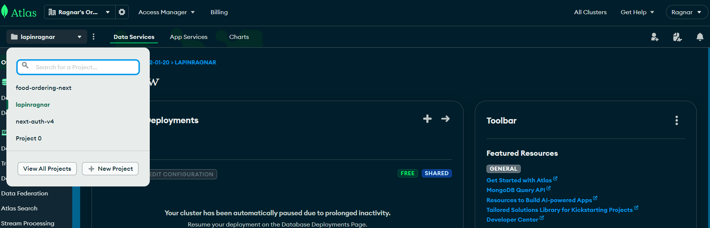
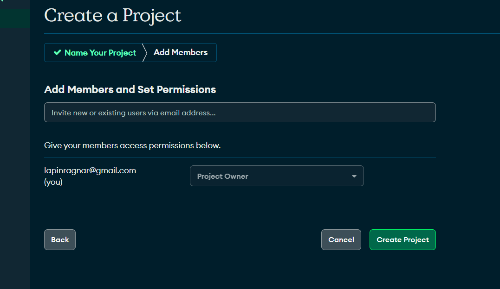
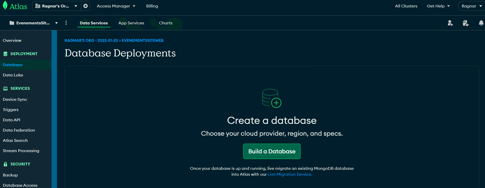
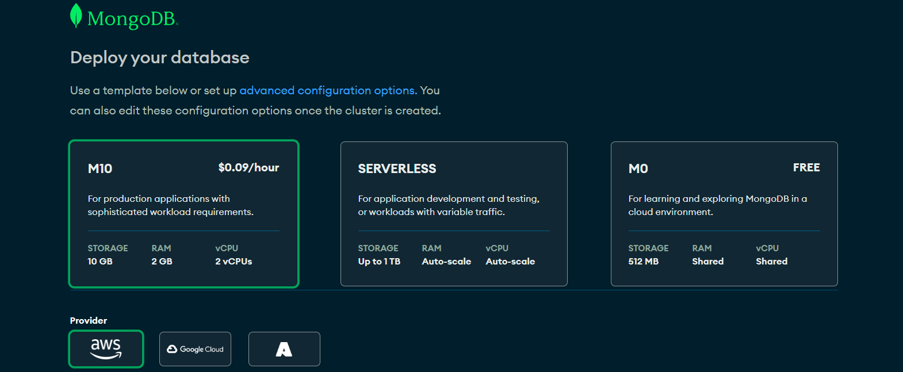
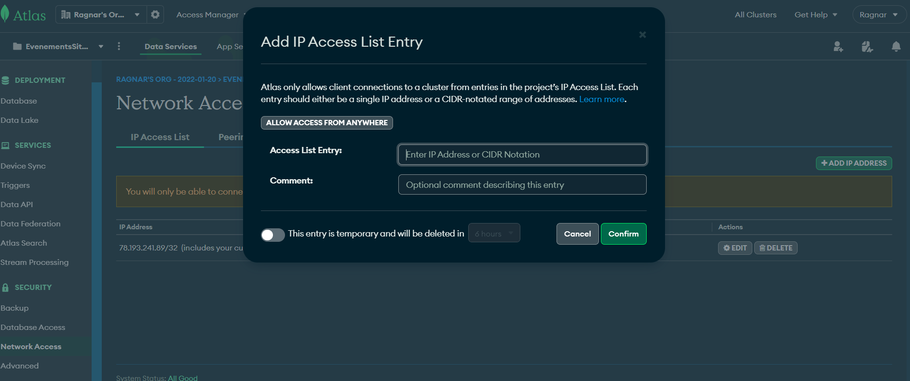
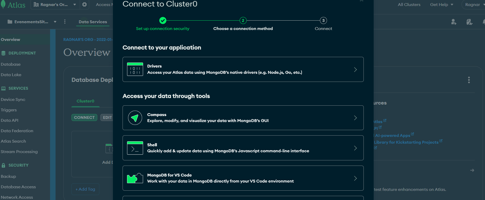

# I- primo


## les etapes de l'installation
## 1. next
```
pnpx create-next-app@latest 
```
puis suivre le prompt
## 2. shadcn ui
```
pnpm dlx shadcn-ui@latest init
npx shadcn-ui@latest init

```
puis suivre le prompt

## 3. configurer globals.css 
(voir le code )
## 4. configurer tailwind (tailwind.config.ts) et uploadthing pour l'upload file
- uploadthing : upload file for nextjs easily
https://uploadthing.com/
command line 
```
pnpm add uploadthing @uploadthing/react
npm install uploadthing @uploadthing/react

```

- tailwind.config.ts
(voir le code ) et les commandes sont:

> tailwind.config.ts
```
import { withUt } from "uploadthing/tw";
 
export default withUt({
  // Your existing Tailwind config
  content: ["./src/**/*.{ts,tsx,mdx}"],
  ...
});
```

## 5- routes && file structure


## 6- Header

#### a- cree un compte clerk sur leur site
- copier les variables d'environnement dans
> .env.local
```
NEXT_PUBLIC_CLERK_PUBLISHABLE_KEY=[votre clé]
CLERK_SECRET_KEY=[votre clé]
```
#### b- install clerk
```
pnpm add @clerk/nextjs
npm install @clerk/nextjs
```

#### c- wrap ton app avec le <ClerkProvider>
> app\(root)\layout.tsx
```
import { ClerkProvider } from '@clerk/nextjs'
import './globals.css'
 
export default function RootLayout({
  children,
}: {
  children: React.ReactNode
}) {
  return (
    <ClerkProvider>
      <html lang="en">
        <body>{children}</body>
      </html>
    </ClerkProvider>
  )
}
```

#### d- le middleware 

> app/middleware.ts
```
import { authMiddleware } from "@clerk/nextjs";
 
// This example protects all routes including api/trpc routes
// Please edit this to allow other routes to be public as needed.
// See https://clerk.com/docs/references/nextjs/auth-middleware for more information about configuring your Middleware
export default authMiddleware({});
 
export const config = {
  matcher: ["/((?!.+\\.[\\w]+$|_next).*)", "/", "/(api|trpc)(.*)"],
};


```

quand on se connecte sur localhost:3000, on est redirige vers /sign-in maintenant

## 6 - suite header
- ajouter le bouton <SignedOut> de clerk
- on cree app/(auth)/sign-in/[[...sign-in]]/page.tsx

> app/(auth)/sign-in/[[...sign-in]]/page.tsx
```
import { SignIn } from "@clerk/nextjs";

export default function Page() {
  return <SignIn />
}
```

- on cree app\(auth)\sign-up\[[...sign-up]]\page.tsx

> app/(auth)/sign-up/[[...sign-up]]/page.tsx
```
import { SignUp } from "@clerk/nextjs";

export default function Page() {
  return <SignUp />
}

```

- on ajoute : 

```
NEXT_PUBLIC_CLERK_SIGN_IN_URL=/sign-in
NEXT_PUBLIC_CLERK_SIGN_UP_URL=/sign-up
NEXT_PUBLIC_CLERK_AFTER_SIGN_IN_URL=/
NEXT_PUBLIC_CLERK_AFTER_SIGN_UP_URL=/

```

- on ajoute un layout 👍 dans (auth)
> app/(auth)/layout.tsx
```
const Layout = ({ children }: { children: React.ReactNode }) => {
  return (
    <div className="flex-center min-h-screen flex-col w-full bg-stone-800 bg-dotted-pattern bg-cover bg-fixed bg-center">
      {children}
    </div>
  )
}

export default Layout
```

- mettre username dans le formulaire le sign-in et le sign-up
  
  


- dans le header, ajouter le  <SignedIn> de clerk

> app/components/shared/Header.tsx
```
import { SignedIn, SignedOut, UserButton } from "@clerk/nextjs"
...
..
<SignedIn>
  <UserButton afterSignOutUrl="/" />
</SignedIn>


```

=> Après ça, on peut se connecter sur localhost:3000/sign-in
=> et tout fonctionne, Bravooooo!


# II- la suite

## 1- la navbar du mobile et du header
- creer un <NavItems /> en dessous du <UserButton afterSignOutUrl="/" />
  > app/components\shared\Header.tsx
 
  ```

  import NavItems from "@/components/shared/NavItems"

  const Header = () => {
    ....
      <SignedIn>
        <UserButton afterSignOutUrl="/" />
        <NavItems />
      </SignedIn>
    .....
  }

  export default Header
  ```

- on cree le : /components/shared/NavItems.tsx"
- regarde le code pour la suite
- install sheet de shadcn pour la bar de navigation à droite
```
npx shadcn-ui@latest add sheet
npx shadcn-ui@latest add separator


```

- regarde le code pour le reste

## 2- le footer

(voir le code)

## 3- le home page - le hero
(voir le code)


# III- le backend && database

## 1- mongoose - ORM pour se connecter au database
https://mongoosejs.com/

- command :
```
npm i mongoose mongodb
```

- créer le fichier : app/lib/mongoDb/database/index.ts
- cette technique est utilisé dans tous les applications Node.js => technique de cache

> app/lib/mongoDb/database/index.ts
```
import mongoose from 'mongoose';

const MONGODB_URI = process.env.MONGODB_URI;

let cached = (global as any).mongoose || { conn: null, promise: null };

export const connectToDatabase = async () => {
  if (cached.conn) return cached.conn;

  if(!MONGODB_URI) throw new Error('MONGODB_URI is missing');

  cached.promise = cached.promise || mongoose.connect(MONGODB_URI, {
    dbName: 'evently',
    bufferCommands: false,
  })

  cached.conn = await cached.promise;

  return cached.conn;
}

```

- se connecter au mongodb atlas et creer un compte
- on creer un nouveau projet 👍
  
  
- on va dans database, et on cree un database:
  
- on choisit FREE :
  

- creer un username et password, copie le dans le .env
- et puis suivre la suite et voila! braaaaavooo!

- le nom de notre database est : EvenementsSiteWeb

- ensuite va dans Network Access, puis Add Address IP, puis allow access from anywhere


- puis dans overview, puis connect : 


- puis, dans le driver, puis copier l'url :mongodb+srv://lapinragnar:<password>@cluster0.59ojkj5.mongodb.net/?retryWrites=true&w=majority dans le .env


- et coler dans .env et mettre l'username et password : 

```
MONGODB_URI=mongodb+srv://lapinragnar:<password>@cluster0.59ojkj5.mongodb.net/?retryWrites=true&w=majority
```


## le tuto
https://www.youtube.com/watch?v=zgGhzuBZOQg
https://github.com/adrianhajdin/event_platform


### variables d'environnement
```
#NEXT
NEXT_PUBLIC_SERVER_URL=

#CLERK
NEXT_PUBLIC_CLERK_PUBLISHABLE_KEY=
CLERK_SECRET_KEY=
NEXT_CLERK_WEBHOOK_SECRET=

NEXT_PUBLIC_CLERK_SIGN_IN_URL=/sign-in
NEXT_PUBLIC_CLERK_SIGN_UP_URL=/sign-up
NEXT_PUBLIC_CLERK_AFTER_SIGN_IN_URL=/
NEXT_PUBLIC_CLERK_AFTER_SIGN_UP_URL=/

#MONGODB
MONGODB_URI=

#UPLOADTHING
UPLOADTHING_SECRET=
UPLOADTHING_APP_ID=

#STRIPE
STRIPE_SECRET_KEY=
STRIPE_WEBHOOK_SECRET=
NEXT_PUBLIC_STRIPE_PUBLISHABLE_KEY=

```