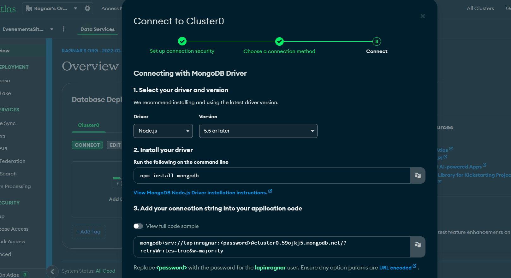

# I- primo


## les etapes de l'installation
## 1. next
```
pnpx create-next-app@latest 
```
puis suivre le prompt
## 2. shadcn ui
```
pnpm dlx shadcn-ui@latest init
npx shadcn-ui@latest init

```
puis suivre le prompt

## 3. configurer globals.css 
(voir le code )
## 4. configurer tailwind (tailwind.config.ts) et uploadthing pour l'upload file
- uploadthing : upload file for nextjs easily
https://uploadthing.com/
command line 
```
pnpm add uploadthing @uploadthing/react
npm install uploadthing @uploadthing/react

```

- tailwind.config.ts
(voir le code ) et les commandes sont:

> tailwind.config.ts
```
import { withUt } from "uploadthing/tw";
 
export default withUt({
  // Your existing Tailwind config
  content: ["./src/**/*.{ts,tsx,mdx}"],
  ...
});
```

## 5- routes && file structure


## 6- Header

#### a- cree un compte clerk sur leur site
- copier les variables d'environnement dans
> .env.local
```
NEXT_PUBLIC_CLERK_PUBLISHABLE_KEY=[votre clé]
CLERK_SECRET_KEY=[votre clé]
```
#### b- install clerk
```
pnpm add @clerk/nextjs
npm install @clerk/nextjs
```

#### c- wrap ton app avec le <ClerkProvider>
> app\(root)\layout.tsx
```
import { ClerkProvider } from '@clerk/nextjs'
import './globals.css'
 
export default function RootLayout({
  children,
}: {
  children: React.ReactNode
}) {
  return (
    <ClerkProvider>
      <html lang="en">
        <body>{children}</body>
      </html>
    </ClerkProvider>
  )
}
```

#### d- le middleware 

> app/middleware.ts
```
import { authMiddleware } from "@clerk/nextjs";
 
// This example protects all routes including api/trpc routes
// Please edit this to allow other routes to be public as needed.
// See https://clerk.com/docs/references/nextjs/auth-middleware for more information about configuring your Middleware
export default authMiddleware({});
 
export const config = {
  matcher: ["/((?!.+\\.[\\w]+$|_next).*)", "/", "/(api|trpc)(.*)"],
};


```

quand on se connecte sur localhost:3000, on est redirige vers /sign-in maintenant

## 6 - suite header
- ajouter le bouton <SignedOut> de clerk
- on cree app/(auth)/sign-in/[[...sign-in]]/page.tsx

> app/(auth)/sign-in/[[...sign-in]]/page.tsx
```
import { SignIn } from "@clerk/nextjs";

export default function Page() {
  return <SignIn />
}
```

- on cree app\(auth)\sign-up\[[...sign-up]]\page.tsx

> app/(auth)/sign-up/[[...sign-up]]/page.tsx
```
import { SignUp } from "@clerk/nextjs";

export default function Page() {
  return <SignUp />
}

```

- on ajoute : 

```
NEXT_PUBLIC_CLERK_SIGN_IN_URL=/sign-in
NEXT_PUBLIC_CLERK_SIGN_UP_URL=/sign-up
NEXT_PUBLIC_CLERK_AFTER_SIGN_IN_URL=/
NEXT_PUBLIC_CLERK_AFTER_SIGN_UP_URL=/

```

- on ajoute un layout 👍 dans (auth)
> app/(auth)/layout.tsx
```
const Layout = ({ children }: { children: React.ReactNode }) => {
  return (
    <div className="flex-center min-h-screen flex-col w-full bg-stone-800 bg-dotted-pattern bg-cover bg-fixed bg-center">
      {children}
    </div>
  )
}

export default Layout
```

- mettre username dans le formulaire le sign-in et le sign-up
  
  


- dans le header, ajouter le  <SignedIn> de clerk

> app/components/shared/Header.tsx
```
import { SignedIn, SignedOut, UserButton } from "@clerk/nextjs"
...
..
<SignedIn>
  <UserButton afterSignOutUrl="/" />
</SignedIn>


```

=> Après ça, on peut se connecter sur localhost:3000/sign-in
=> et tout fonctionne, Bravooooo!


# II- la suite

## 1- la navbar du mobile et du header
- creer un <NavItems /> en dessous du <UserButton afterSignOutUrl="/" />
  > app/components\shared\Header.tsx
 
  ```

  import NavItems from "@/components/shared/NavItems"

  const Header = () => {
    ....
      <SignedIn>
        <UserButton afterSignOutUrl="/" />
        <NavItems />
      </SignedIn>
    .....
  }

  export default Header
  ```

- on cree le : /components/shared/NavItems.tsx"
- regarde le code pour la suite
- install sheet de shadcn pour la bar de navigation à droite
```
npx shadcn-ui@latest add sheet
npx shadcn-ui@latest add separator


```

- regarde le code pour le reste

## 2- le footer

(voir le code)

## 3- le home page - le hero
(voir le code)


# III- le backend && database

## 1. mongoose - ORM pour se connecter au database
https://mongoosejs.com/

- command :
```
npm i mongoose mongodb
```

- créer le fichier : app/lib/mongoDb/database/index.ts
- cette technique est utilisé dans tous les applications Node.js => technique de cache

> app/lib/mongoDb/database/index.ts
```
import mongoose from 'mongoose';

const MONGODB_URI = process.env.MONGODB_URI;

let cached = (global as any).mongoose || { conn: null, promise: null };

export const connectToDatabase = async () => {
  if (cached.conn) return cached.conn;

  if(!MONGODB_URI) throw new Error('MONGODB_URI is missing');

  cached.promise = cached.promise || mongoose.connect(MONGODB_URI, {
    dbName: 'evently',
    bufferCommands: false,
  })

  cached.conn = await cached.promise;

  return cached.conn;
}

```

- se connecter au mongodb atlas et creer un compte
- on creer un nouveau projet 👍
  
  
- on va dans database, et on cree un database:
  
- on choisit FREE :
  

- creer un username et password, copie le dans le .env
- et puis suivre la suite et voila! braaaaavooo!

- le nom de notre database est : EvenementsSiteWeb

- ensuite va dans Network Access, puis Add Address IP, puis allow access from anywhere


- puis dans overview, puis connect : 


- puis, dans le driver, puis copier l'url :mongodb+srv://lapinragnar:<password>@cluster0.59ojkj5.mongodb.net/?retryWrites=true&w=majority dans le .env



- et coler dans .env.local et mettre l'username et password : 

```
MONGODB_URI=mongodb+srv://lapinragnar:<password>@cluster0.59ojkj5.mongodb.net/?retryWrites=true&w=majority
```

## 2. création des models

- on crée le fichier pour User : app/lib/mongoDb/models/user.model.ts
- et le code suivant 🥈:
> app/lib/mongoDb/models/user.model.ts
```
import { Schema, model, models } from "mongoose";

const UserSchema = new Schema({
  clerkId: { type: String, required: true, unique: true },
  email: { type: String, required: true, unique: true },
  username: { type: String, required: true, unique: true },
  firstName: { type: String, required: true },
  lastName: {type: String, required: true },
  photo: { type: String, required: true },
})

const User = models.User || model('User', UserSchema);

export default User;

```

- on fait la même chose pour le model event, order, category :

> app/lib/mongoDb/models/event.model.ts

```
import { Document, Schema, model, models } from "mongoose";

export interface IEvent extends Document {
  _id: string;
  title: string;
  description?: string;
  location?: string;
  createdAt: Date;
  imageUrl: string;
  startDateTime: Date;
  endDateTime: Date;
  price: string;
  isFree: boolean;
  url?: string;
  category: { _id: string, name: string }
  organizer: { _id: string, firstName: string, lastName: string }
}

const EventSchema = new Schema({
  title: { type: String, required: true },
  description: { type: String },
  location: { type: String },
  createdAt: { type: Date, default: Date.now },
  imageUrl: { type: String, required: true },
  startDateTime: { type: Date, default: Date.now },
  endDateTime: { type: Date, default: Date.now },
  price: { type: String },
  isFree: { type: Boolean, default: false },
  url: { type: String },
  category: { type: Schema.Types.ObjectId, ref: 'Category' },
  organizer: { type: Schema.Types.ObjectId, ref: 'User' },
})

const Event = models.Event || model('Event', EventSchema);

export default Event;

```


> app/lib/mongoDb/models/order.model.ts

```
import { Schema, model, models, Document } from 'mongoose'

export interface IOrder extends Document {
  createdAt: Date
  stripeId: string
  totalAmount: string
  event: {
    _id: string
    title: string
  }
  buyer: {
    _id: string
    firstName: string
    lastName: string
  }
}

export type IOrderItem = {
  _id: string
  totalAmount: string
  createdAt: Date
  eventTitle: string
  eventId: string
  buyer: string
}

const OrderSchema = new Schema({
  createdAt: {
    type: Date,
    default: Date.now,
  },
  stripeId: {
    type: String,
    required: true,
    unique: true,
  },
  totalAmount: {
    type: String,
  },
  event: {
    type: Schema.Types.ObjectId,
    ref: 'Event',
  },
  buyer: {
    type: Schema.Types.ObjectId,
    ref: 'User',
  },
})

const Order = models.Order || model('Order', OrderSchema)

export default Order

```

> app/lib/mongoDb/models/category.model.ts

```

import { Document, Schema, model, models } from "mongoose";

export interface ICategory extends Document {
  _id: string;
  name: string;
}

const CategorySchema = new Schema({
  name: { type: String, required: true, unique: true },
})

const Category = models.Category || model('Category', CategorySchema);

export default Category;


```


## 3. creation des fonctions qui va nous permettre de se connecter au database et d'utiliser les models

- le webhook (clerk) : quand clerc cree un user, on se synchronise avec le database
- la doc : https://clerk.com/docs/users/sync-data#sync-clerk-data-to-your-backend-with-webhooks


- activer le webhook sur clerk: on fait, add Endpoint
  


> ***les etapes de l'installation***


### a- Install the svix package
```
npm install svix
```

### b- Create the endpoint in your application

on cree le fichier

> app/api/webhooks/route.ts
```


```

on cree l'action : createUser dans 
> lib\actions\user.action.ts


```

import { Webhook } from 'svix'
import { headers } from 'next/headers'
import { WebhookEvent } from '@clerk/nextjs/server'
import { createUser, deleteUser, updateUser } from '@/lib/actions/user.action'
import { clerkClient } from '@clerk/nextjs'
import { NextResponse } from 'next/server'
 
export async function POST(req: Request) {
 
  // You can find this in the Clerk Dashboard -> Webhooks -> choose the webhook
  const WEBHOOK_SECRET = process.env.WEBHOOK_SECRET
 
  if (!WEBHOOK_SECRET) {
    throw new Error('Please add WEBHOOK_SECRET from Clerk Dashboard to .env or .env.local')
  }
 
  // Get the headers
  const headerPayload = headers();
  const svix_id = headerPayload.get("svix-id");
  const svix_timestamp = headerPayload.get("svix-timestamp");
  const svix_signature = headerPayload.get("svix-signature");
 
  // If there are no headers, error out
  if (!svix_id || !svix_timestamp || !svix_signature) {
    return new Response('Error occured -- no svix headers', {
      status: 400
    })
  }
 
  // Get the body
  const payload = await req.json()
  const body = JSON.stringify(payload);
 
  // Create a new Svix instance with your secret.
  const wh = new Webhook(WEBHOOK_SECRET);
 
  let evt: WebhookEvent
 
  // Verify the payload with the headers
  try {
    evt = wh.verify(body, {
      "svix-id": svix_id,
      "svix-timestamp": svix_timestamp,
      "svix-signature": svix_signature,
    }) as WebhookEvent
  } catch (err) {
    console.error('Error verifying webhook:', err);
    return new Response('Error occured', {
      status: 400
    })
  }
 
  // Get the ID and type
  const { id } = evt.data;
  const eventType = evt.type;

  if (eventType === 'user.created') {

    const { id, email_addresses, image_url, first_name, last_name, username } = evt.data;


    const user = {
      clerkId: id,
      email: email_addresses[0].email_address,
      username: username!,
      firstName: first_name,
      lastName: last_name,
      photo: image_url,
    }


    const newUser = await createUser(user);

    if(newUser) {
      await clerkClient.users.updateUserMetadata(id, {
        publicMetadata: {
          userId: newUser._id
        }
      })
    }

    return NextResponse.json({ message: 'OK', user: newUser })
  
  }


  if (eventType === 'user.updated') {
    const {id, image_url, first_name, last_name, username } = evt.data

    const user = {
      firstName: first_name,
      lastName: last_name,
      username: username!,
      photo: image_url,
    }

    const updatedUser = await updateUser(id, user)

    return NextResponse.json({ message: 'OK', user: updatedUser })
  }

  if (eventType === 'user.deleted') {
    const { id } = evt.data

    const deletedUser = await deleteUser(id!)

    return NextResponse.json({ message: 'OK', user: deletedUser })
  }


 
  console.log(`Webhook with and ID of ${id} and type of ${eventType}`)
  console.log('Webhook body:', body)
 
  return new Response('', { status: 200 })
}
 


```


on cree le type dans 

> app/types/index.ts

```
// ====== USER PARAMS
export type CreateUserParams = {
  clerkId: string
  firstName: string
  lastName: string
  username: string
  email: string
  photo: string
}

export type UpdateUserParams = {
  firstName: string
  lastName: string
  username: string
  photo: string
}

// ====== EVENT PARAMS
export type CreateEventParams = {
  userId: string
  event: {
    title: string
    description: string
    location: string
    imageUrl: string
    startDateTime: Date
    endDateTime: Date
    categoryId: string
    price: string
    isFree: boolean
    url: string
  }
  path: string
}

export type UpdateEventParams = {
  userId: string
  event: {
    _id: string
    title: string
    imageUrl: string
    description: string
    location: string
    startDateTime: Date
    endDateTime: Date
    categoryId: string
    price: string
    isFree: boolean
    url: string
  }
  path: string
}

export type DeleteEventParams = {
  eventId: string
  path: string
}

export type GetAllEventsParams = {
  query: string
  category: string
  limit: number
  page: number
}

export type GetEventsByUserParams = {
  userId: string
  limit?: number
  page: number
}

export type GetRelatedEventsByCategoryParams = {
  categoryId: string
  eventId: string
  limit?: number
  page: number | string
}

export type Event = {
  _id: string
  title: string
  description: string
  price: string
  isFree: boolean
  imageUrl: string
  location: string
  startDateTime: Date
  endDateTime: Date
  url: string
  organizer: {
    _id: string
    firstName: string
    lastName: string
  }
  category: {
    _id: string
    name: string
  }
}

// ====== CATEGORY PARAMS
export type CreateCategoryParams = {
  categoryName: string
}

// ====== ORDER PARAMS
export type CheckoutOrderParams = {
  eventTitle: string
  eventId: string
  price: string
  isFree: boolean
  buyerId: string
}

export type CreateOrderParams = {
  stripeId: string
  eventId: string
  buyerId: string
  totalAmount: string
  createdAt: Date
}

export type GetOrdersByEventParams = {
  eventId: string
  searchString: string
}

export type GetOrdersByUserParams = {
  userId: string | null
  limit?: number
  page: string | number | null
}

// ====== URL QUERY PARAMS
export type UrlQueryParams = {
  params: string
  key: string
  value: string | null
}

export type RemoveUrlQueryParams = {
  params: string
  keysToRemove: string[]
}

export type SearchParamProps = {
  params: { id: string }
  searchParams: { [key: string]: string | string[] | undefined }
}

```


on cree une fonction pour gérer nos erreurs dans 👍

> app/lib/utils.ts :

il faut installer query-string :

 ```
 npm i query-string
 ```

puis, copier le code suivant dans app/lib/utils.ts

```
import { type ClassValue, clsx } from 'clsx'

import { twMerge } from 'tailwind-merge'
import qs from 'query-string'

import { UrlQueryParams, RemoveUrlQueryParams } from '@/types'

export function cn(...inputs: ClassValue[]) {
  return twMerge(clsx(inputs))
}

export const formatDateTime = (dateString: Date) => {
  const dateTimeOptions: Intl.DateTimeFormatOptions = {
    weekday: 'short', // abbreviated weekday name (e.g., 'Mon')
    month: 'short', // abbreviated month name (e.g., 'Oct')
    day: 'numeric', // numeric day of the month (e.g., '25')
    hour: 'numeric', // numeric hour (e.g., '8')
    minute: 'numeric', // numeric minute (e.g., '30')
    hour12: true, // use 12-hour clock (true) or 24-hour clock (false)
  }

  const dateOptions: Intl.DateTimeFormatOptions = {
    weekday: 'short', // abbreviated weekday name (e.g., 'Mon')
    month: 'short', // abbreviated month name (e.g., 'Oct')
    year: 'numeric', // numeric year (e.g., '2023')
    day: 'numeric', // numeric day of the month (e.g., '25')
  }

  const timeOptions: Intl.DateTimeFormatOptions = {
    hour: 'numeric', // numeric hour (e.g., '8')
    minute: 'numeric', // numeric minute (e.g., '30')
    hour12: true, // use 12-hour clock (true) or 24-hour clock (false)
  }

  const formattedDateTime: string = new Date(dateString).toLocaleString('en-US', dateTimeOptions)

  const formattedDate: string = new Date(dateString).toLocaleString('en-US', dateOptions)

  const formattedTime: string = new Date(dateString).toLocaleString('en-US', timeOptions)

  return {
    dateTime: formattedDateTime,
    dateOnly: formattedDate,
    timeOnly: formattedTime,
  }
}

export const convertFileToUrl = (file: File) => URL.createObjectURL(file)

export const formatPrice = (price: string) => {
  const amount = parseFloat(price)
  const formattedPrice = new Intl.NumberFormat('en-US', {
    style: 'currency',
    currency: 'USD',
  }).format(amount)

  return formattedPrice
}

export function formUrlQuery({ params, key, value }: UrlQueryParams) {
  const currentUrl = qs.parse(params)

  currentUrl[key] = value

  return qs.stringifyUrl(
    {
      url: window.location.pathname,
      query: currentUrl,
    },
    { skipNull: true }
  )
}

export function removeKeysFromQuery({ params, keysToRemove }: RemoveUrlQueryParams) {
  const currentUrl = qs.parse(params)

  keysToRemove.forEach(key => {
    delete currentUrl[key]
  })

  return qs.stringifyUrl(
    {
      url: window.location.pathname,
      query: currentUrl,
    },
    { skipNull: true }
  )
}

export const handleError = (error: unknown) => {
  console.error(error)
  throw new Error(typeof error === 'string' ? error : JSON.stringify(error))
}


```


### c- A faire après le deploiement sinon ca ne marche pas

##### - ajouter un endpoint - Enable webhooks : https://gestion-des-evenement-next14-stripe-mongoose-clerc-typescript.vercel.app/api/webhook/clerk


- ensuite cocher user comme ceci:


- puis cliquer sur créer

- puis copier le signing secret:


- et le mettre dans le .env

> .env
```
WEBHOOK_SECRET="copier le code ici"
```

NB: Il faut aussi mettre cette clé dans vercel variable d'environnement

ici : 


*** <font color='red'> TRES IMPORTANT : IL FAUT REDEPLOYER l'application sur vercel pour mettre à jour les variables d'environnement </font>***


- on supprime l'user qu'on a crée dans clerk

- maintenant on test sur notre localhost:3000 de créer un nouvel user et on verifie si l'user est ajouté aussi dans la base de donnée mongodb


# IV- deploiement

- ojouter nouveau projet,
- importer le projet du github
- copier le .env


## le tuto
https://www.youtube.com/watch?v=zgGhzuBZOQg
https://github.com/adrianhajdin/event_platform


### variables d'environnement
```
#NEXT
NEXT_PUBLIC_SERVER_URL=

#CLERK
NEXT_PUBLIC_CLERK_PUBLISHABLE_KEY=
CLERK_SECRET_KEY=
NEXT_CLERK_WEBHOOK_SECRET=

NEXT_PUBLIC_CLERK_SIGN_IN_URL=/sign-in
NEXT_PUBLIC_CLERK_SIGN_UP_URL=/sign-up
NEXT_PUBLIC_CLERK_AFTER_SIGN_IN_URL=/
NEXT_PUBLIC_CLERK_AFTER_SIGN_UP_URL=/

#MONGODB
MONGODB_URI=

#UPLOADTHING
UPLOADTHING_SECRET=
UPLOADTHING_APP_ID=

#STRIPE
STRIPE_SECRET_KEY=
STRIPE_WEBHOOK_SECRET=
NEXT_PUBLIC_STRIPE_PUBLISHABLE_KEY=

```


# le demo - site publié sur vercel
https://gestion-des-evenement-next14-stripe-mongoose-clerc-typescript.vercel.app/

dep